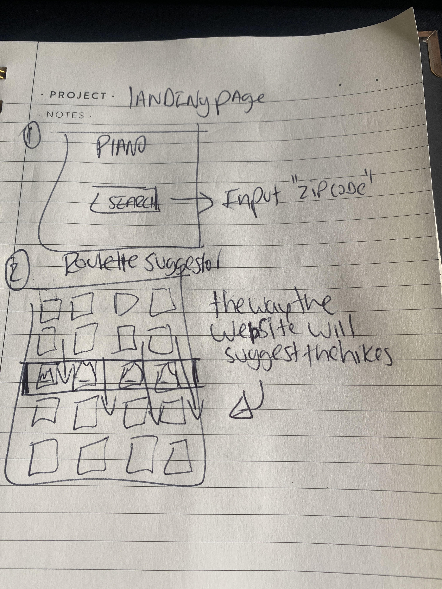
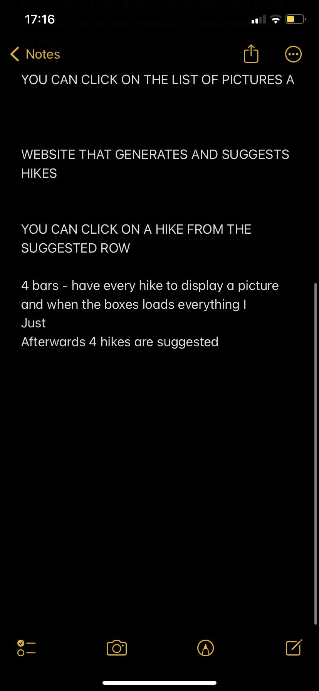
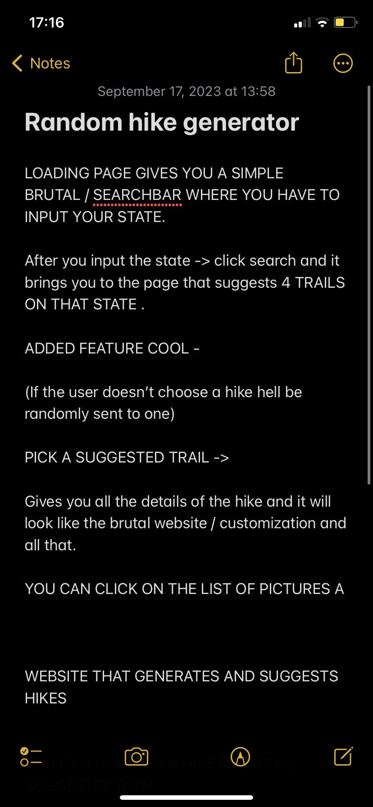

Research & Planning Log

Sunday 09/17 (for this date I am providing images proving the time of researching and planning put into the project as I simply forgot to make commits)

**PLEASE CHECK THE ATTACHED IMAGES

---

**Click on these images as well 

**History to show hours researching about the UI 

12:55 - Started ideating what I want to do with the project overall - after seeing different examples I have decided that I want to focus more on the UI aspects but with all the required functionalities of a hiking website.

13:58 - Designed how i want my landing page to look like - image below shows my thinking process of how i want the whole website to look like in terms of UI and step by step of what the user will see as he loads and navigates the website. 

16:32 - finished extensive research into web design.

16:57 - Found the API, national parks API. Researching into whether I will only use an API or DB. I have only found one db with specific parameters on kaggle but only for the state of Oregon. 

17:34 - Working on the capstone proposal, found most info that I will need to create the UI. 

18:14 - Researching how to connect C# with React file, currently not working and not everything is committing. 

18:58 - found that i could use WEBGL and three.js, but node not working cant load into project yet. 

20:57 - Watched Yt vids which gave me ideas of how to use three.js to build on scroll animations and 3d backgrounds.